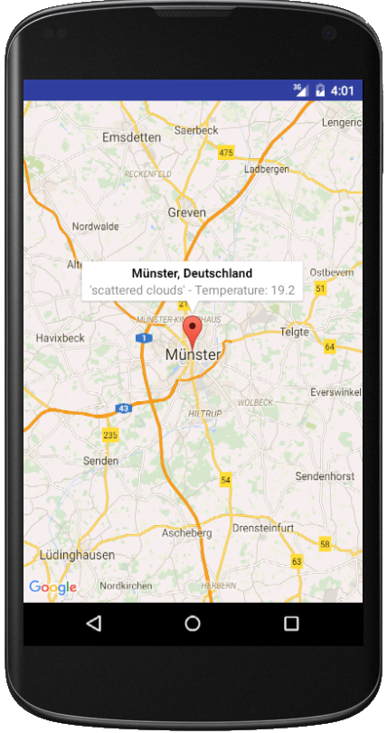
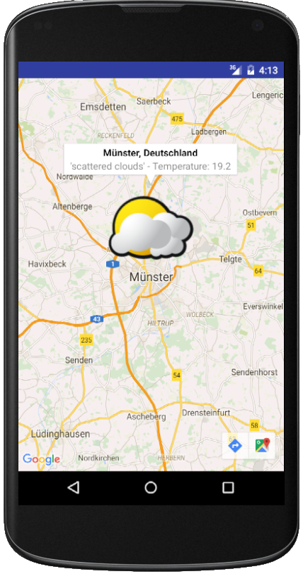
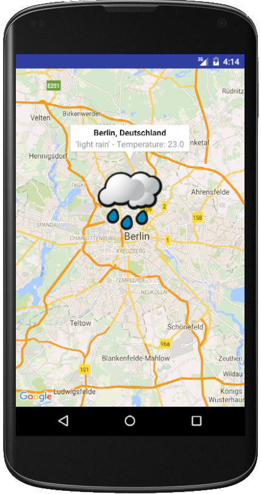
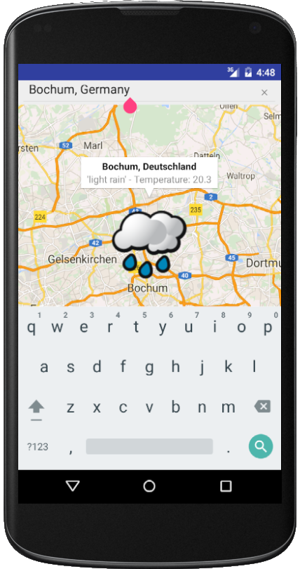

# KSwe SoSe 2016 - Aufgabe 6a

Aufgabe ist es eine Android-App zu entwickeln, welche Daten über die
[Geodata API](http://geoapi-kswe2016.rhcloud.com/) abruft und visualisiert. Zur Visualisierung soll die `GoogleMap` View genutzt werden.

Die App sollte dann so ähnlich wie im folgenden Screenshot die Daten darstellen:



## Projektbasis

Android Studio verfügt über ein Projekt-Template, das bereits die Google Maps API
verwendet. Nach dem Erstellen eines Projektes mit diesem Template muss ein
[API Key](https://developers.google.com/maps/documentation/android-api/signup)
eingetragen werden.

Nach dem erfolgreichen Setup soll die
[Geodata API](http://geoapi-kswe2016.rhcloud.com/) abgerufen werden und die Daten
als `Marker` visualisiert werden. Nutze zunächst vorgegebene Werte für Stadt
und Land. Zur Abfrage via HTTP soll
[Volley]() genutzt werden. Volley kann in die `build.gradle` der App eingebunden
werden:

```
compile 'com.android.volley:volley:1.0.0'
```

Tipp: Zur optimalen Abfrage der Daten kann direkt das `JsonObjectRequest`
genutzt werden, welches die Daten als `JSONObject` zurück gibt.

## Erweiterung #1

Die `MarkerOptions` erlauben die Definition eines Icons. Suche im Netz nach
passenden Symbolen für Wetter-Gegebenheiten und binde - je nach Wetterlage -
ein entsprechendes Symbol ein.

Beispiele:





## Erweiterung #2

Erweitere das User Interface um ein Suchfeld. Bei Drücken der Enter-Taste soll
die Geodata API entsprechend nach der Stadt abgefragt werden und die Daten
auf der Karte visualisiert werden.

Beispiel:



## Veröffentlichung

Stelle deine beiden Projekte auf GitHub online!
